# Texel-Powerview
Solar monitoring embedded device utilizing Raspberry Pis to talk to solar inverters.

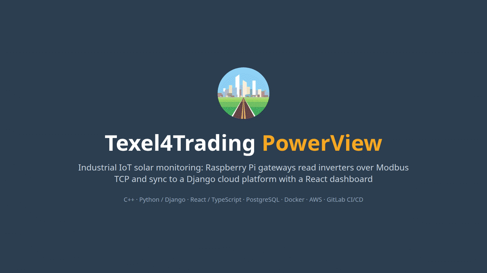

**Texel4Trading PowerView** is an Industrial IoT solar monitoring platform built as a Smart Cities group project (HvA, 2026).
Raspberry Pi gateways auto-discover SunSpec inverters on the local network, read them over Modbus TCP and sync
telemetry to a Django backend, where fleet managers and owners view it through a React dashboard. It is
designed to scale from a single home installation to large sites such as floating solar farms.

**Stack:** C++ (libmodbus, libcurl) · Python / Django REST Framework · Celery + Redis · PostgreSQL ·
React + TypeScript (TanStack Query, Recharts) · Microsoft Entra ID (MSAL) · Docker · Nginx · WireGuard · AWS · GitLab CI/CD

## Highlights

- **Zero-touch site commissioning.** A Python CLI built on the State pattern downloads and verifies a Raspberry Pi OS
  image, injects Wi-Fi credentials, registers the device with the cloud and flashes the SD card, so a technician can
  set up a site without an engineer.
- **Automatic inverter discovery.** The embedded C++ service scans the subnet on port 502, identifies SunSpec devices
  and reports them to the backend. Admins approve each inverter before polling starts.
- **Multi-threaded polling.** One polling thread per approved inverter decodes the SunSpec and SolarEdge register
  maps (AC/DC power, phase voltages, energy, heatsink temperature) and bundles readings for each check-in.
- **Per-device credentials.** Every device has its own secret, sent as an `X-Device-Token` header. Users sign in with
  Microsoft Entra ID and get role-based access to fleet, site and admin views.
- **Multi-environment infrastructure.** Production runs on AWS with managed PostgreSQL. Dev and QA run on a self-hosted
  Xeon server behind an Nginx gateway linked over WireGuard, with gated GitLab deployments to each environment.

## Architecture

Full write-up: [docs/WorkingArchitecture.md](docs/WorkingArchitecture.md)

### Technician setup tool

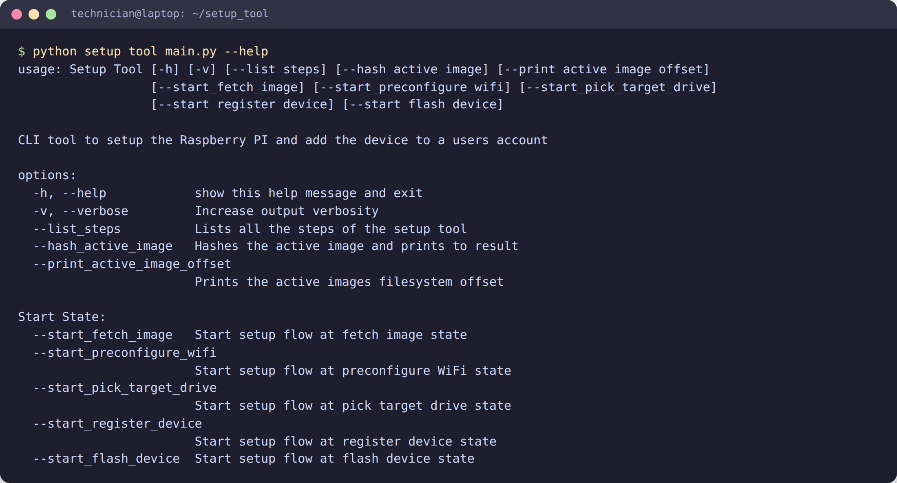

## Dashboard

| | |
|---|---|
| 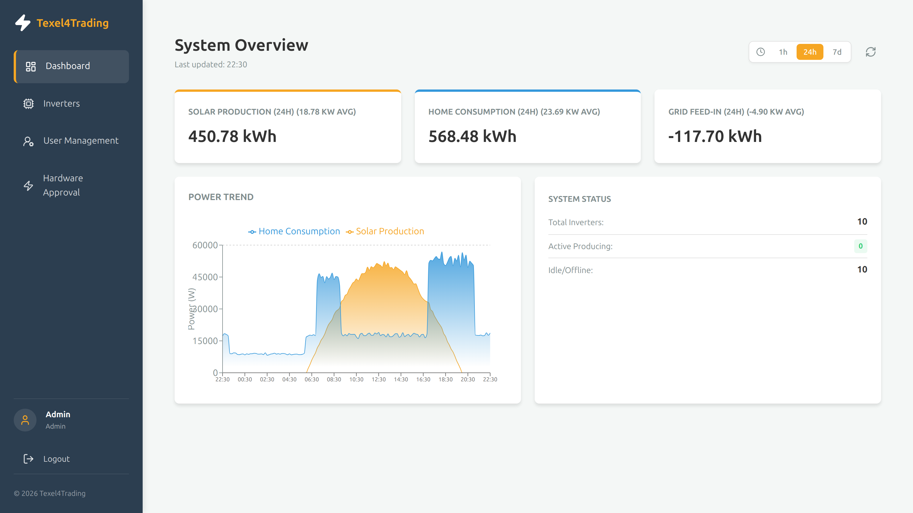 | 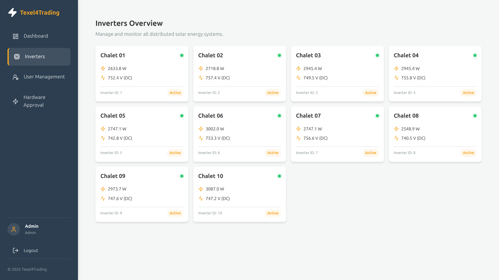 |
| 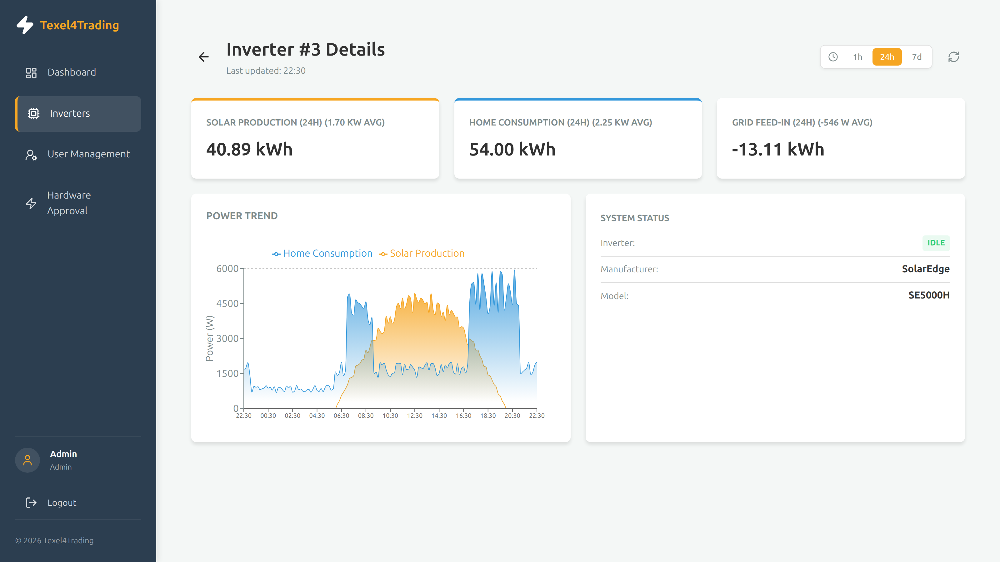 | 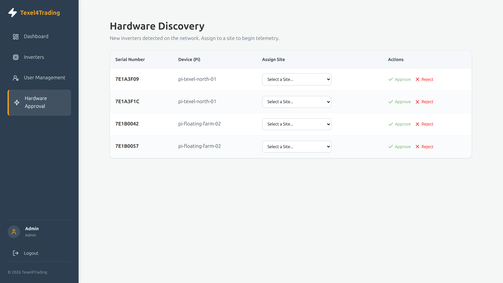 |

Screenshots use the frontend's built-in mock data.

| | |
|---|---|
| 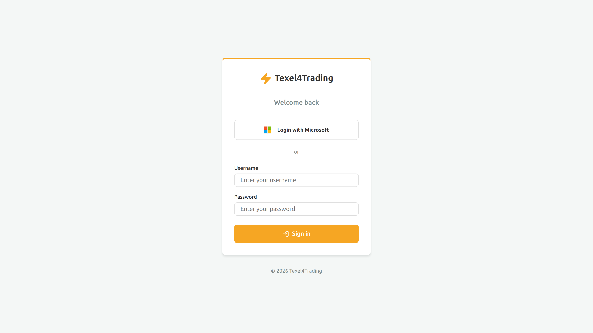 | 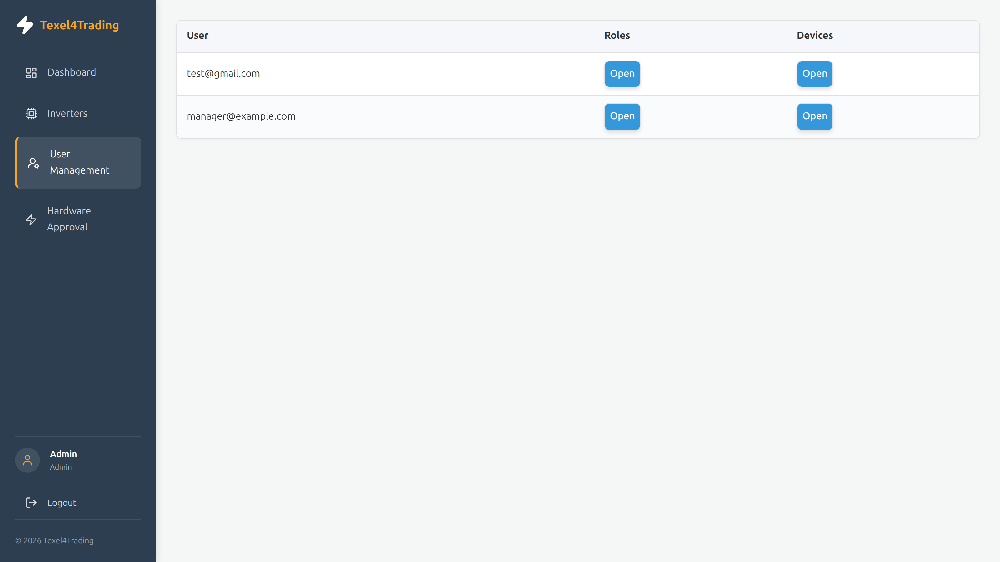 |

## In the field

| | | |
|---|---|---|
| 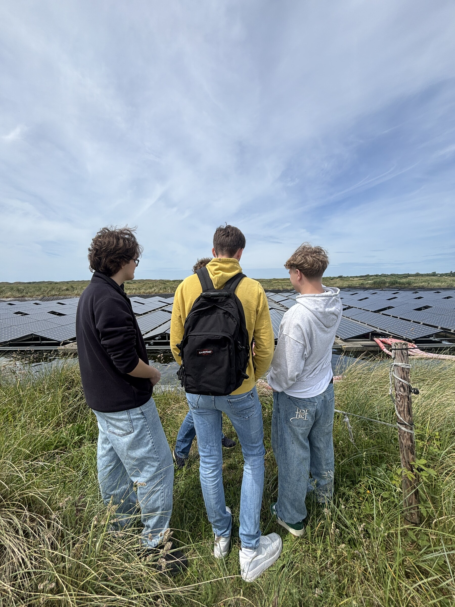 | 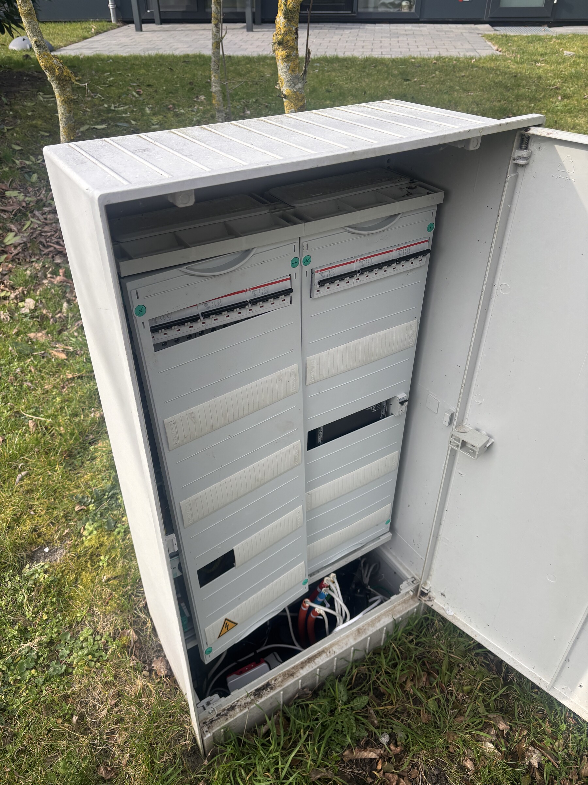 | 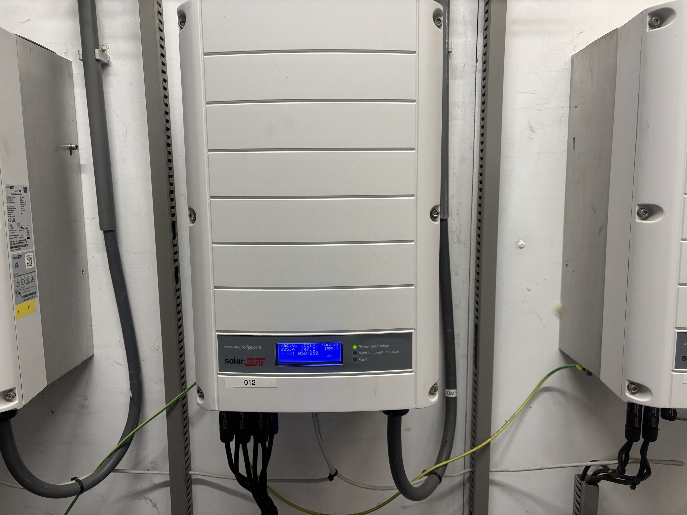 |
| Our team at the client's floating solar facility | Junction box where one PowerView gateway reads the inverters of six houses | One of the SolarEdge inverters our gateways read over Modbus TCP |

## Repository contents

| Path | What |
|---|---|
| `docs/` | Product vision, working architecture, frontend feature spec |
| `media/architecture.jpg` | System architecture diagram |
| `media/screenshots/` | Dashboard and CLI screenshots (3200×1800) |
| `media/field-work/` | Photos from site visits |
| `Demo.gif` | Demo GIF |
