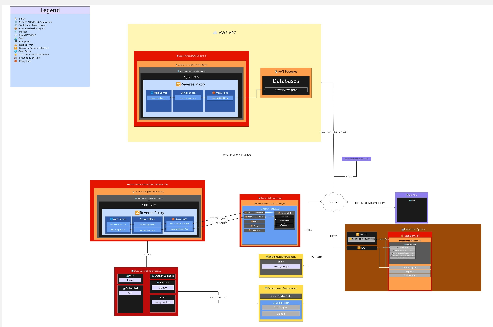

# Working Architecture

## Introduction
This document describes the current working architecture for Texel4Trading PowerView.
It explains how the system is split across infrastructure, backend services, embedded devices, and local environments so each sprint can deliver a stable MVP.

## Target Audience
- Developers working on backend, frontend, embedded, and setup tooling
- QA members validating behavior across dev, QA, and prod deployments
- Technicians setting up and operating Raspberry Pi devices on-site
- Stakeholders who need a practical view of the deployed system

## System Architecture Diagram

## Architecture Overview
To reuse existing hardware and infrastructure efficiently, the platform is split into clearly scoped components. Production runs fully on AWS. Non-production (dev and QA) environments run on a separate Digital Ocean cloud provider and a custom Xeon server. The embedded site layer and development tooling remain environment-agnostic.

### 1. AWS Production Environment
Production is hosted entirely within an AWS Virtual Private Cloud (VPC), providing network isolation, scalability, and managed infrastructure. This is the live environment serving end users and connected inverter sites.
AWS Cloud Provider (Gateway)
An AWS-hosted Ubuntu server acts as the internet-facing gateway for production traffic. It is intentionally lightweight, routing requests to the backend and serving frontend assets.

#### Nginx Reverse Proxy
Routes incoming HTTPS requests for the production domain. Serves the React build artifacts for non-/api routes and proxies /api requests through to the backend.
WireGuard VPN: Not applicable in production — backend communication within the AWS VPC is handled via internal AWS networking. HTTPS is terminated at the gateway.

#### AWS PostgreSQL (Managed Database)
Production uses a managed AWS PostgreSQL instance, separate from the on-premises PostgreSQL container used for dev and QA. This provides automated backups and point-in-time recovery, independent scaling from the application tier, and reduced operational overhead compared to a self-managed container. The production database is only accessible from within the AWS VPC.
Production Backend (Django on AWS)
The Django backend for production runs as a Dockerized container within the AWS environment. It connects to the managed AWS PostgreSQL instance and shares the same codebase as dev and QA, with environment-specific configuration applied via environment variables.

### 2. Cloud Provider (Gateway)
The cloud server is the internet-facing gateway for the platform. It has limited resources (2 GB RAM, 20 GB disk, low CPU), so it is intentionally lightweight.

- **Nginx Reverse Proxy**
	- Routes incoming requests to the correct environment (`dev`, `qa`) using separate server blocks.
	- Serves environment-specific React build artifacts for web traffic.
	- For `/api` routes, proxies requests to the backend on the main server using the matching environment port.
	- For non-`/api` routes, serves static frontend assets (`index.html`, CSS, JS).
- **WireGuard VPN**
	- Secures communication between the gateway and the main application server.
	- Backend proxy traffic is currently HTTP over WireGuard; HTTPS termination is planned for a future hardening phase.

### 3. Main Application Server (Custom Xeon)
This server hosts the backend business logic and persistent data.

- **Django Backend (Dockerized)**
	- Runs isolated backend containers for `dev`, `qa`.
	- Uses shared and environment-specific variables to keep deployments consistent while allowing environment overrides.
- **PostgreSQL (Single Container, Multi-Database)**
	- One PostgreSQL container hosts multiple databases (one per environment).
	- Environment database names are prefixed with `powerview`.
- **Redis (Dockerized)**
	- Provides the Celery broker and result backend for background job processing.
	- Keeps asynchronous task messages and task state outside the main web request flow.
- **Celery (Dockerized)**
	- Runs background workers for Django tasks such as sync-state maintenance.
	- Executes shared tasks defined in the backend, including the hourly sync-status check.
- **Celery-Beat (Dockerized)**
	- Schedules recurring Celery tasks using Django Celery Beat's database scheduler.
	- Triggers the periodic job that marks devices as sync overdue when they have not reported in time.

### 4. Embedded System (Site Layer)
The embedded layer is centered around a Raspberry Pi that mediates communication between physical inverters and the cloud backend.

- **Network Switch**
	- Connects one or more inverters to the Raspberry Pi.
- **SunSpec Inverters**
	- DC-to-AC inverters that expose data via SunSpec-compliant interfaces.
- **Wireless Access Point (WAP)**
	- Provides internet connectivity for the Raspberry Pi.
- **Raspberry Pi**
	- Runs the C++ embedded application and is remotely manageable over SSH.
	- Selected because it was already available in Texel and supports rapid iteration.
- **Open SSH Server**
  - Runs under systemd and is responsible for connections to the PI for manual work.
- **firstboot.service**
  - Runs required device setup logic for first time boot of the PI.
- **powerview-embedded.service**
  - The systemd service responsible for managing the C++ Program.
  - Ensures the C++ program starts with boot of the system.
- **powerview-embedded-sync.service**
  - Syncs all the inverter data collected by the C++ Program and uploads to API.
- **powerview-embedded-sync.timer**
  - The schedule on which powerview-embedded-sync.service will run
- **C++ Embedded Application**
	- Uses `libmodbus` and `libcurl` as core dependencies.
	- Handles automatic inverter discovery.
	- Reads and normalizes inverter telemetry.
	- Sends telemetry to the backend for processing and storage.

### 5. Raspberry Pi OS Source
`downloads.raspberrypi.com` is used as the trusted upstream source for Raspberry Pi OS images used in device provisioning.

## Environments

### Development Environment
- Main day-to-day environment for the team.
- Uses Docker to simplify backend and embedded-related services.
- Frontend (React) is commonly run natively for faster feedback loops.

### Technician Environment
- Used by field technicians to run the setup tool.
- Requires Python to be installed.
- Requires setup tool source code and configuration artifacts to be available locally.

## Current Trade-Offs
- HTTP backend proxying is acceptable for now because traffic is tunneled through WireGuard, but HTTPS end-to-end remains a security hardening target.
- A single PostgreSQL container with separate databases lowers infrastructure overhead but creates a shared database host dependency.
- Running multiple environments on one physical application server is cost-effective but can introduce resource contention during heavy load.
